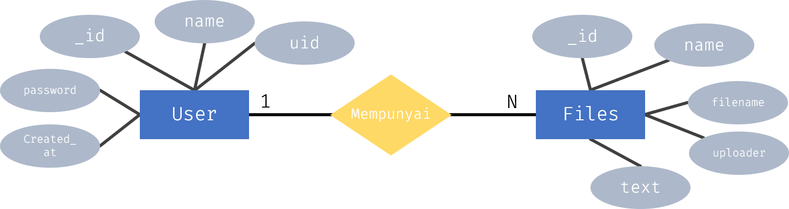

# 3. Metode Penelitian

## 3.1 Prosedur Penelitian

Prosedur Penelitian merupakan serangkaian kegiatan yang dilaksanakan secara sistematis serta teratir agar mencapai tujuan dari penelitian ini. Adapun prosedur penelitian sebagai berikut :

1. Analisa Kebutuhan Sistem
   Dalam tahap ini, dilakukan analisa terhadap kebutuhan sebuah sistem seperti bagaimana tampilan sistem, bagaimana cara kerja sistem, ataupun penggunaan bahasa pemrograman yang tepat.
2. Studi Literatur
   Dalam tahap ini, dilakukan pengumpulan teori - teori ataupun landasan dasar dalam proses membangun sebuah sistem yang akan dibuat.
3. Perancangan Sistem
   Dalam tahap ini, dilakukan pembangunan Sistem Pendeteksi Kesamaan Teks Menggunakan Metode Dice Similarity dengan menggunakan metode, teori, ataupun bahasa pemrograma yang telah ditentukan sebelumnya.
4. Pengujian Sistem
   Dalam tahap ini, dilakukan testing atau pengujian terhadap sistem.

## 3.2 Rancangan Sistem

### 3.2.1 Use Case Diagram

Use Case Diagram adalah suatu jenis diagram yang menggambarkan hubungan atau interaksi dari sebuah sistem dengan pengguna. Dengan adanya Use Diagram, kita dapat mendeskripsikan tipe atau jenis yang dilakukan pengguna terhadap sebuah sistem. Berikut use case diagram dari Sistem Pendeteksi Kesamaan Teks Menggunakan Metode Dice Similarity.

Dalam use case diagram digambar, terdapat 3 jenis user yang akan menggunakan sistem ini yaitu Admin, User, dan Guest. Admin memiliki akses terhadap semua sistem baik manajemen dari user, dan juga manajemen data yang disimpan dalam database. Untuk user, hanya memiliki akses terhadap data yang disimpan kedalam database nantinya berdasarkan yang dimiliki oleh user. Selain itu, user juga dapat menggunakan sistem pendeteksi kesamaan dokumen yang ada dalam sistem ini. Sedangkan guest atau tamu hanya bisa meakukan pendeteksi kesamaan dokument dan tidak bisa melakukan manajemen data yang ada didalam database.

### 3.2.2 Entity Relationship Diagram (ERD)

Entity Relationship Diagram (ERD) adalah suatu jenis diagram yang digunakan untuk merancang suatu basis data (database). Dalam ERD, terdapat beberapa komponen seperti entitas, relasi, atribut, dan garis penghubung dimana digunakan untuk memperlihatkan hubungan atau relasi antar entitas atau objek yang terlihat beserta atributnya. Berikut ER diagram dari Sistem Pendeteksi Kesamaan Teks Menggunakan Metode Dice Similarity.

Berdasarkan ERD di atas, terdapat dua entitas yaitu User dan Files, dimana User memiliki beberapa atribut yaitu \_id, name, password, uid, password, dan created_at. Sedangkan Files memiliki beberapa atribut juga sepeerti \_id, name, filename, uploader, dan text. Tabel User mempunya relasi One to Many terhadap Tabel Files, sedangakan sebaliknya yaitu Tabel Files memiliki relasi One to One terhadap Tabel User.

### 3.2.3 Desain Sistem

Pada bagian ini, akan menjelaskan bagaimana desain suatu sistem yang diimplemetasikan. Dengan adanya desain sistem ini, dapat memberikan gambaran rancang bangun yang lengkap terhadap pengguna dari sistem ini.

#### 3.2.3.1 Algoritma Input Teks ke Dalam Database

Keterangan :

1. Input Teks
   Sebelum membandingkan teks yang akan ditentukan kesamaannya, terlebih dahulu dibuat sebuah repositori atau database teks yang akan digunakan sebagai pembanding nantinya. Teks yang diinput pada penelitian ini berupa file yang berformat Pdf (Portable Document Format).

2. Konversi Teks
   Teks yang telah diinput, kemudian diubah kedalam bentuk tipe data _String_ agar dapat diolah nantinya didalam sistem.

3. Hapus Stopword
   Stopword merupakan kata yang diabaikan karena memeiliki frekuensi kemunculan yang sangat tinggi dan tidak mempunyai arti. Beberapa contoh Stopw word seperti, "atau", "dan", dan "tapi". Dengan menghapus Stopword, sistem dapat bekerja lebih cepat karena Stopword akan menghapus kata yang abaikan.

4. Hapus Karakter
   Selain Stopword, karakter seperti ",", ".", "?", dll yang hanya berupa karakter yang tidak memiliki arti dan fungsi karena sistem hanya memeriksa kata.

5. Simpan di Database
   Setelah teks telah melewati tahap sebelumnya, maka teks akan dimasukkan kedalam database yang nantinya akan digunakan saat ingin mendapatkan persentase kemiripan dari teks yang akan dibandingkan nantinya.

#### 3.2.3.2 Algoritma Perbandingan Teks

Keterangan :

1. Input Teks
   Input teks yang akan dibandingkan kedalam sistem yang nantinya akan dibandingkan terhadap teks yang terdapat dalam database atau repositori. Teks yang diinput berupa teks yang berformat Pdf (Portable Document Format).

2. Konversi Teks
   Teks yang telah diinput, kemudian diubah kedalam bentuk tipe data _String_ agar dapat diolah nantinya didalam sistem.

3. Hapus Stopword
   Stopword merupakan kata yang diabaikan karena memeiliki frekuensi kemunculan yang sangat tinggi dan tidak mempunyai arti. Beberapa contoh Stopw word seperti, "atau", "dan", dan "tapi". Dengan menghapus Stopword, sistem dapat bekerja lebih cepat karena Stopword akan menghapus kata yang abaikan.

4. Hapus Karakter
   Selain Stopword, karakter seperti ",", ".", "?", dll yang hanya berupa karakter yang tidak memiliki arti dan fungsi karena sistem hanya memeriksa kata.

5. Hitung Nilai Kemiripan
   Setelah teks melewati tahap sebelumnya, maka teks akan dibandingan dengan semua teks yang terdapat didalam database atau repositori. Teks akan dibandingkan dengan semua data teks dengan menggunakan metode Dice Similarity. Kemudian hasil kemiripan antar teks akan muncul sebanyak data yang terdapat dalam database atau repositori teks.

## 3.3 Metode Penelitian

Dalam sistem ini, metode perhitungan yang digunakan adalam metode Dice Similarity dengan membandingkan data teks yang diinput pengguna dengan teks yang terdapat didalam database atau repositori teks.

### 3.3.1 Algoritma Dice Similarity

Algoritma perhitungan persentase kemiripan antar teks sebagai berikut :

1. Persiapan Data.
   Sebelum dilakukan perhitungan, data dipsiapkan terlebih dahulu, dimana data input teks merupakan data yang akan dibandingkan dengan data teks yang terdapat didalam database atau repositori.

2. Pembuatan Kamus Data.
   Untuk mempermudah perhitungan Dice Similarity, dilakukan pembuatan kamus data yang berisi kata yang terdapat didalam input teks maupun data teks yang berasal dari database atau repositori. Pada awal tahap ini, dilakukan perulangan sebanyak kata yang terdapat didalam input teks kemudian dilakukan penngkondisian jika didalam kamus kata tidak terdapat index yang sama dengan kata, maka kata tersebut ditambahkan kedalam kamus. Setelah itu, dilakukan perulangan terhadap data dalam database atau repositori kemudian dilakukan perulangan kembali sebanyak kata yang terdapat didalam teks dan dilakukan hal yang sama dengan input teks diawal.

3. Perhitungan Jumlah Kata di Dalam Kamus Data.
   Sebelum dilakukan perhitungan, terlebih dahulu ditentukan jumlah kata yang terdapat didalam teks untuk data teks input dan data teks dari database. Pada awal tahap ini, dilakukan perulangan sebanyak kata yang terdapat didalam input teks kemudian dilakukan penngkondisian jika didalam kamus kata terdapat kata yang sama dengan kata yang terdapat di kamus kata, maka kata untuk indek input teks akan bertambah satu. dilakukan perulangan terhadap data dalam database atau repositori kemudian dilakukan perulangan kembali sebanyak kata yang terdapat didalam teks dan dilakukan hal yang sama dengan input teks diawal.

4. Perhitungan Kemiripan Menggunakan Metode Dice Similarity.
   Setelah memperoleh kamus data, maka akan dilakukan perhitungan untuk memberikan persentase kemiripan antara input teks dan data teks yang berasal dari database. Ditahap ini dilakukan perulangan sebanyak data dalam database. Kemudian dilakukan perhitungan sesuai dengan rumus dari Dice Similarity kemudian hasilnya akan ditampilkan.

### 3.3.2 Implementasi Dice Similarity

Untuk pengimplementasian dari Metode Cosine Similarity, diambil contoh dari definisi dari komputer menurut para ahli yaitu Menurut Robert H. Blissmer _komputer adalah suatu alat elektronik yang mampu melakukan beberapa tugas seperti menerima input, memproses input tadi sesuai dengan programnya, menyimpan perintah-perintah dan hasil pengolahan, serta menyediakan output dalam bentuk informasi_. Sedangkan menurut Arief Susanto, _komputer adalah sekelompok alat elektronik yang terdiri atas perintah input, alat yang mengolah input, dan peralatan output yang memberikan informasi serta bekerja secara otomatis_. (Susanto, 2009).

Setelah mendapatkan kedua data diatas, kemudian dilakukan pembagian. Untuk pengertian dari Robert H. Blissmer akan menjadi data dari database sebagai X, kemudian untuk pengertian dari Arief Susanto akan menjadi data yang akan dibandingkan dengan data dari database sebagai Y. Sebelum diolah, kedua data diatas akan dilakukan penghapusan Stopword dan karaktek yang tidak berguna dalam perhitungan nantinya sehingga menjadi :

| Data X                                                                                                                                                  | Data Y                                                                                            |
| ------------------------------------------------------------------------------------------------------------------------------------------------------- | ------------------------------------------------------------------------------------------------- |
| alat elektronik tugas menerima input memproses input sesuai programnya menyimpan perintah-perintah hasil pengolahan menyediakan output bentuk informasi | sekelompok alat elektronik perintah input alat mengolah input peralatan output informasi otomatis |

Setelah dilakukan penghapusan Stopword dan karaktek yang tidak berguna, kemudian dilakukan pembuatan kamus kata lalu dilakukan perhutngan jumlah kata terhadap kamus data yang ada sehingga menjadi.

| Kamus Kata  | Data X | Data Y |
| ----------- | :----: | :----: |
| alat        |   2    |   1    |
| elektronik  |   1    |   1    |
| informasi   |   1    |   1    |
| input       |   2    |   2    |
| mengolah    |   1    |   0    |
| otomatis    |   1    |   0    |
| output      |   1    |   1    |
| peralatan   |   1    |   0    |
| perintah    |   1    |   2    |
| sekelompok  |   1    |   0    |
| bentuk      |   0    |   1    |
| hasil       |   0    |   1    |
| memproses   |   0    |   1    |
| menerima    |   0    |   1    |
| menyediakan |   0    |   1    |
| menyimpan   |   0    |   1    |
| pengolahan  |   0    |   1    |
| programnya  |   0    |   1    |
| sesuai      |   0    |   1    |
| tugas       |   0    |   1    |

Setelah itu, data diatas akan diubah menjadi vektor satu dimensi sehingga menjadi :

  

Kemudian kedua vektor diatas dimasukkan kedalam rumus Dice Similarity Sehingga Menjadi :

}{|X|^2&space;+&space;|Y|^2}>)

Untuk mempermudah perhitungan, dilakukan beberapa penambahan row dan field sehingga menjadi :

| Kamus Data  | Data X | Data Y |  X.Y   |  X2   |  Y2   |
| ----------- | :----: | :----: | :----: | :----: | :----: |
| alat        |   2    |   1    |   2    |   4    |   1    |
| bentuk      |   0    |   1    |   0    |   0    |   1    |
| elektronik  |   1    |   1    |   1    |   1    |   1    |
| hasil       |   0    |   1    |   0    |   0    |   1    |
| infromasi   |   1    |   1    |   1    |   1    |   1    |
| input       |   2    |   2    |   4    |   4    |   4    |
| memproses   |   0    |   1    |   0    |   0    |   1    |
| menerima    |   0    |   1    |   0    |   0    |   1    |
| mengolah    |   1    |   0    |   0    |   1    |   0    |
| menyediakan |   0    |   1    |   0    |   0    |   1    |
| menyimpan   |   0    |   1    |   0    |   0    |   1    |
| otomatis    |   1    |   0    |   0    |   1    |   0    |
| output      |   1    |   1    |   1    |   1    |   1    |
| perintah    |   1    |   2    |   2    |   1    |   4    |
| perlatan    |   1    |   0    |   0    |   1    |   0    |
| programnya  |   0    |   1    |   0    |   0    |   1    |
| sekelompok  |   1    |   0    |   0    |   1    |   0    |
| sesuai      |   0    |   1    |   0    |   0    |   1    |
| tugas       |   0    |   1    |   0    |   0    |   1    |
| **Total**   | **12** | **18** | **11** | **16** | **22** |

Setelah memperoleh table diatas, kemudian nilai tersebut dimasukkan kedalam rumus Dice Similarity sehingga menjadi :

}{|X|^2&space;+&space;|Y|^2}>)  
  
  

Sehingga diperoleh nilai Dice Similarity adalah 0,5789473684 atau jika dipersentasekan menjadi 57, 8 %. Jadi, Persentase kesamaan antara antara Data X dengan Data Y adalah sebesar 57, 8 %

## 3.4 Instrumen Penelitian

Instrumen yang digunakan dalam penelitian ini adalah laptop dengan processor AMD Athlon 300U with Radeon Vega Mobile Gfx 2.40 GHz dan RAM sebanyak 8 GB serta sistem operasi windows 10 Home 64 bit.
